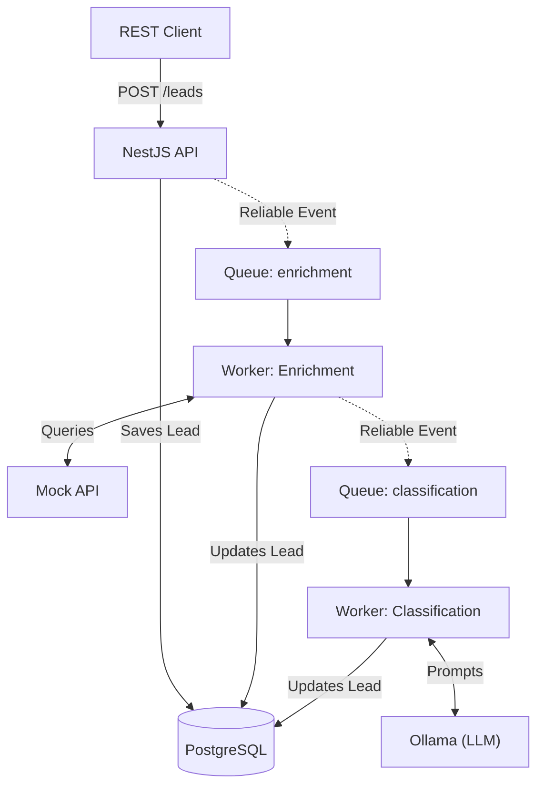
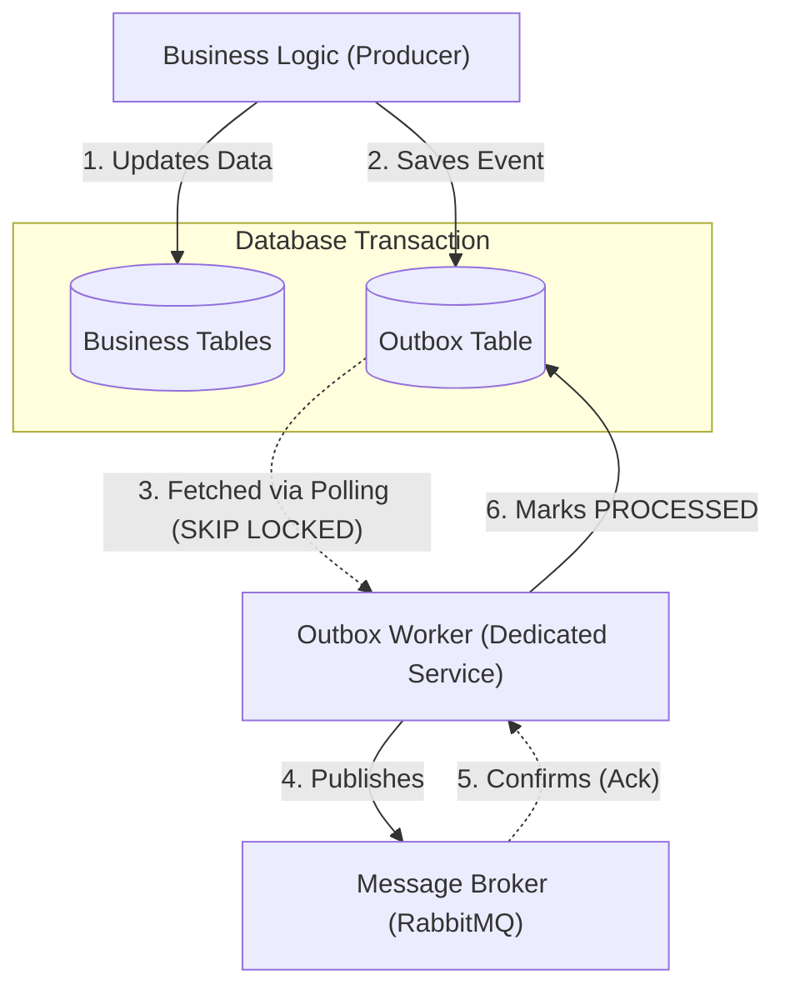
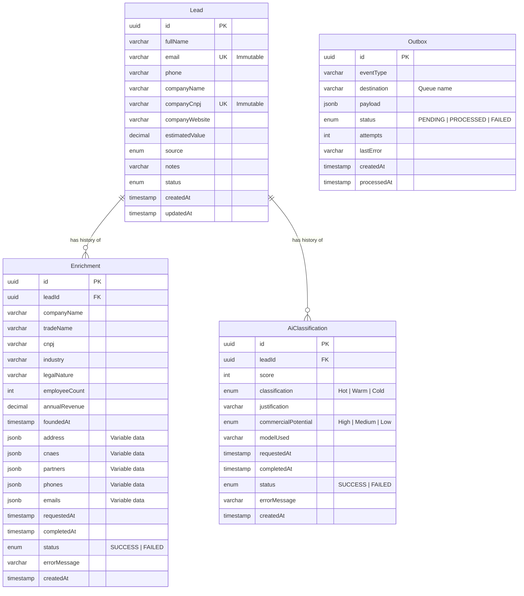

# Lead Enrichment and Classification System

*[Leia em Português / Read in Portuguese](./README.pt-BR.md)*

This repository contains a resilient system for commercial lead management, integrating data enrichment via external API and AI-assisted classification (Ollama), orchestrated asynchronously.

## Technologies

The stack was chosen focusing on productivity, strong typing, and robustness, following the system requirements:

- Runtime: Node.js (v20) + TypeScript
- Framework: NestJS (v11) - Chosen for its opinionated architecture and native dependency injection.
- Persistence: PostgreSQL (v16) + Prisma ORM - Strong typing generated from the schema, avoiding runtime errors.
- Messaging: RabbitMQ - The heart of asynchronous processing.
- Local AI: Ollama running the `tinyllama` model - Lightweight, fast, and does not depend on external API keys.
- Quality and Tests: Vitest (faster than standard Jest) and ESLint/Prettier.
- Infrastructure: Docker and Docker Compose.

---

## Architecture and Design Decisions

A critical aspect of the system is ensuring data consistency against external API failures or malformed AI returns. The decisions below mitigate these risks:

### 1. Asynchronous Processing and Orchestration (Pipeline)

To avoid blocking HTTP requests, the API merely accepts the lead (HTTP 202 Accepted) and delegates processing.

Critical Decision: Triggering enrichment and classification simultaneously would create a race condition, as the AI needs the enriched data (revenue, employees) to calculate an accurate score.
Solution: I implemented a chained flow (Pipeline).

1. The Lead is created and an event is queued for `enrichment`.
2. The Enrichment Worker processes the data.
3. Only on success, the worker itself queues an event for `classification`.

**Diagram 1: High-Level System Pipeline**
*(Note: The reliable event publishing mechanism is simplified here. See Diagram 2 for details).*



**Diagram 2: Reliable Delivery (Outbox Service Detail)**
*(This details how the "Reliable Event" arrows in Diagram 1 actually work without losing data).*




### 2. Resilience with RabbitMQ (DLX/DLQ)

Distributed systems fail. To avoid losing leads:

- Channel control is done via `amqp-connection-manager`.
- Implementation of Dead Letter Exchanges (DLX) and Dead Letter Queues (DLQ).
- Business errors (e.g., AI returned unrecoverable garbage) generate a `FAILED` status and the message receives an `ack`.
- Infrastructure errors (e.g., database unavailable, network timeout) generate a `nack` and the message is routed to the DLQ, allowing subsequent reprocessing without blocking the main queue.

### 3. State Machine

A lead has a strict lifecycle: `PENDING` -> `ENRICHING` -> `ENRICHED` -> `CLASSIFYING` -> `CLASSIFIED`.
To prevent a concurrent request from trying to classify a lead that is still being enriched, transitions are validated atomically before any database update, ensuring domain consistency.

### 4. Handling AI "Hallucinations"

Small models like `tinyllama` are efficient but may ignore prompt instructions.

- Prompt Engineering: Ollama is configured to enforce JSON output format (`format: 'json'`).
- Schema Validation (Zod): The AI return goes through a strict parser. If the model omits mandatory fields (`score`, `classification`) or invents values outside the allowed enums, the execution is marked as `FAILED`, without crashing the worker.

### 5. Immutable History (Light Event Sourcing)

To meet the traceability requirement, instead of overwriting the lead's data, I opted for separate tables for `Enrichment` and `AiClassification`. Each reprocessing inserts a new record, allowing auditing of the score evolution and comparing executions over time.

### 6. Hybrid Storage Strategy (Relational + Document)

One of the biggest challenges in data enrichment is heterogeneity: one lead may have 10 partners and 3 addresses, while another may have none. Creating fixed columns for everything would generate sparse tables that are hard to maintain.
The adopted solution was a hybrid model in PostgreSQL:

- Fixed Columns (Schema-on-Write): Essential and predictable data (like `annualRevenue`, `employeeCount`, `industry`) have typed columns. This ensures integrity and allows fast analytical queries (e.g., `WHERE annualRevenue > 1000000`).
- JSONB Fields (Schema-on-Read): Variable structural data (like `partners`, `cnaes`, `address`) are stored in `JSONB` columns. PostgreSQL natively handles JSONB in binary format, allowing internal indexing without rigidifying the schema. If the data provider changes structure tomorrow, the database won't break and won't require complex migrations.

### 7. Outbox Pattern (Transactional Messaging)

To avoid the "Dual Write" problem where an event might be saved to the database but fail to publish to RabbitMQ, a system-wide Outbox Pattern was implemented.
- **Transactional Integrity:** Every service that needs to publish a message (API, Enrichment Worker, etc.) saves the business data and the `Outbox` event in a single database transaction.
- **Dedicated Outbox Service:** To maintain the main API as a stateless and highly scalable service, the Outbox Worker is implemented as a separate, standalone service. This separation ensures that the stateful nature of the polling mechanism (managing retry logic and batching) does not impact the scalability of the lead management operations.
- **Concurrency & Scalability:** The worker uses PostgreSQL's `FOR UPDATE SKIP LOCKED` combined with partial indexes to ensure multiple worker instances can run in parallel without locking contentions.
- **Backpressure Handling:** The worker uses dynamic polling intervals and publisher confirms to avoid overwhelming RabbitMQ during spikes.
- **Adapter Architecture:** The messaging implementation is decoupled via a `MessagePublisher` interface, allowing the underlying broker to be swapped without changing the business logic.

## Data Modeling

The schema was designed to support the full execution history and reliable messaging.




---

## How to run the project

The infrastructure has been completely containerized for easy execution.

### 1. Clone the repository

```bash
git clone https://github.com/your-user/lead-management-system.git
cd lead-management-system
```

### 2. Start the infrastructure

This command will build the API and start PostgreSQL, RabbitMQ, Mock API, and Ollama.

```bash
docker compose up -d
```

Attention: On the first run, the Ollama container will download the `tinyllama` model (~637MB). The time will depend on your connection. Follow the progress with:

```bash
docker compose logs -f ollama
```

### 3. Database (Migrations and Seed)

The API container automatically runs migrations on startup (`npx prisma migrate deploy`). 

To populate the database with test leads (valid CNPJs), run the seed command inside the API container:

```bash
docker compose exec api npm run db:seed
```

*Development Tip:* If you want to connect a database client (like DBeaver or DataGrip) on your local machine, use `localhost:5432` with user `postgres` and password `password`. If you want to run Prisma commands locally (e.g., `npx prisma studio`), temporarily change the `DATABASE_URL` in your `.env` file from `postgres:5432` to `localhost:5432`.

### 4. Accessing the API (The First Request)

The API will be available at `http://localhost:3000`.

To test the complete end-to-end flow (Creation -> Enrichment -> Classification), run the following command in your terminal:

```bash
curl -X POST http://localhost:3000/leads \
  -H "Content-Type: application/json" \
  -d '{
    "fullName": "João da Silva",
    "email": "joao.silva@techcorp.com",
    "phone": "+5511999991111",
    "companyName": "Tech Corp",
    "companyCnpj": "12345678000199",
    "source": "WEBSITE"
  }'
```

The API will return a `201 Created` status almost instantly. The heavy lifting is happening in the background.
To follow the application logs and see the workers processing the lead:

```bash
docker compose logs -f api
```

After a few seconds, you can query the updated lead (replace the ID with the one returned in the POST):

```bash
curl http://localhost:3000/leads/LEAD_ID
```

### 5. Observability

To easily visualize what is happening in the system, especially during presentations, two observability tools have been included in the cluster:

**Dozzle (Real-time Log Viewer):**

- Access: `http://localhost:8080`
- Dozzle allows you to see the logs of all containers (API, Workers, Ollama, RabbitMQ) directly from the browser, with search and filters, without needing to use the terminal.

**RabbitMQ Management UI (Queue Monitoring):**

- Access: `http://localhost:15672`
- User: `guest`
- Password: `guest`
- Through this dashboard, you can see messages traversing between queues (`lead.enrichment`, `lead.classification`), check the processing rate, and inspect the Dead Letter Queue (DLQ) in case of failures. *(Note: Default credentials `guest/guest` are used only for local development environment).*

---

## Running the Tests

The project uses Vitest for unit and integration testing.

```bash
# Run tests
docker compose exec api npm run test

# Run tests with coverage report
docker compose exec api npm run test:cov
```

---

## Main Endpoints

### Leads

- `POST /leads` - Creates a new lead (triggers enrichment automatically).
- `GET /leads` - Lists leads. Supports pagination (`?page=1&limit=10`) and filters (`?search=term&source=WEBSITE`).
- `GET /leads/:id` - Retrieves lead details, including enrichment and classification history.
- `PATCH /leads/:id` - Updates data (except `email` and `companyCnpj`, which are immutable).
- `GET /leads/export` - Dedicated route for exporting consolidated data.

### Asynchronous Flows (Reprocessing)

- `POST /leads/:id/enrichment` - Requests a new enrichment.
- `POST /leads/:id/classification` - Requests a new AI classification.

---

## Trade-offs and Limitations

Every architecture involves choices. Below are the main trade-offs assumed in this implementation:

1. **Hybrid Storage (JSONB) vs Fixed Columns:**
  - *Decision:* Use `JSONB` for variable enrichment data (like partners and CNAEs).
  - *Trade-off:* We gain extreme flexibility to handle external APIs that change their contract, but we lose the ability to create rigid Foreign Keys for these specific data points.
2. **Local Ollama (tinyllama) vs Proprietary API (OpenAI/Anthropic):**
  - *Decision:* Use a small local model to provide a cost-effective solution without generating external API costs.
  - *Trade-off:* `tinyllama` is fast but has a higher propensity for "hallucinations" and JSON formatting breakage compared to larger models. The mitigation was the use of strict validation (Zod), but in a production environment with a budget, a managed external API would deliver more accurate classifications.
3. **Polling vs Webhooks/SSE:**
  - *Decision:* The client needs to perform a `GET /leads/:id` to check if asynchronous processing has finished.
  - *Trade-off:* Keeps the backend architecture simple and focused on workers. In a real reactive frontend scenario, implementing Webhooks or Server-Sent Events (SSE) would be necessary to notify the client in real time, but would add complexity outside the current scope.

---

## Future Improvements (Production Vision)

For a large-scale production environment, the following improvements would be implemented:

1. Caching (Redis): Avoid repeated calls to the enrichment API for the same CNPJ in short periods.
2. Authentication and Authorization: Protect endpoints with JWT and RBAC (Role-Based Access Control).
3. Observability (Prometheus/Grafana): Monitor Ollama's average response time and JSON parsing failure rate. Stochastic models require continuous monitoring.
4. Rate Limiting: Protect the API against abuse, especially on routes that trigger background processing.

