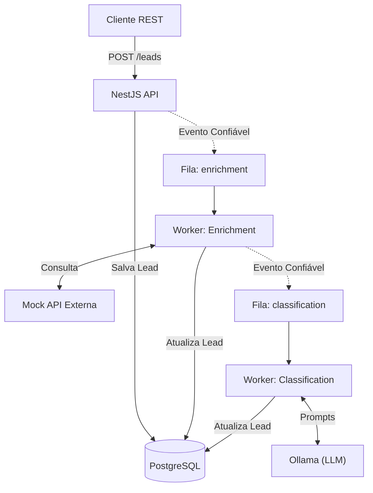
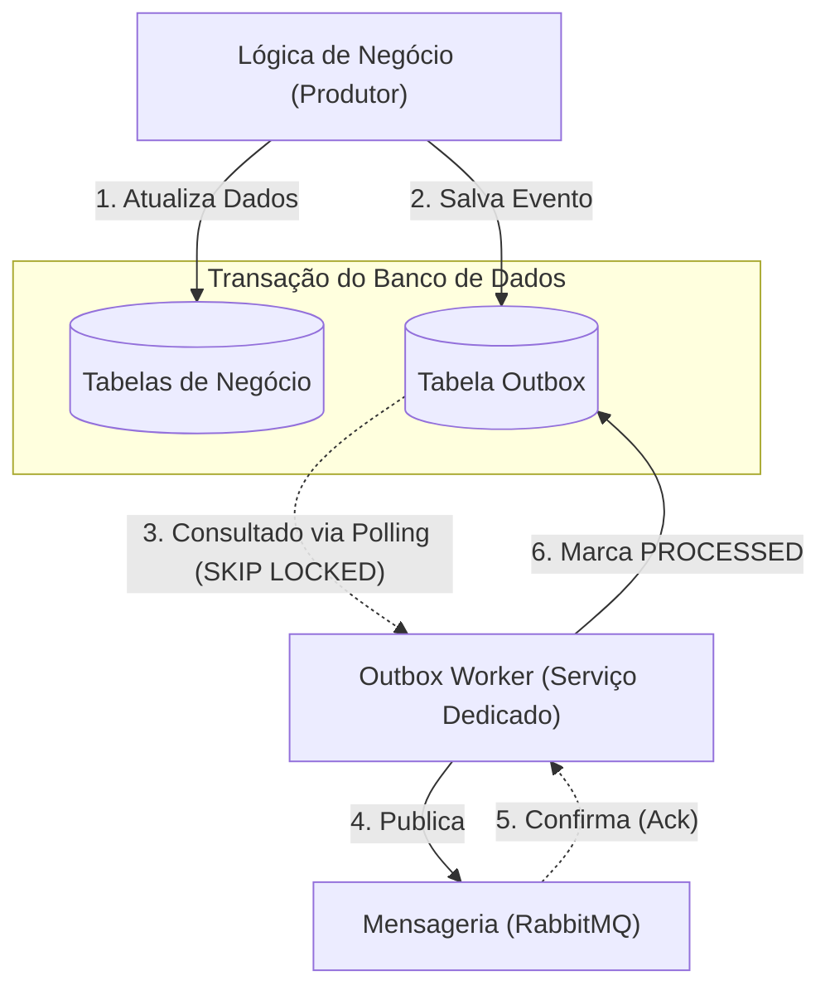
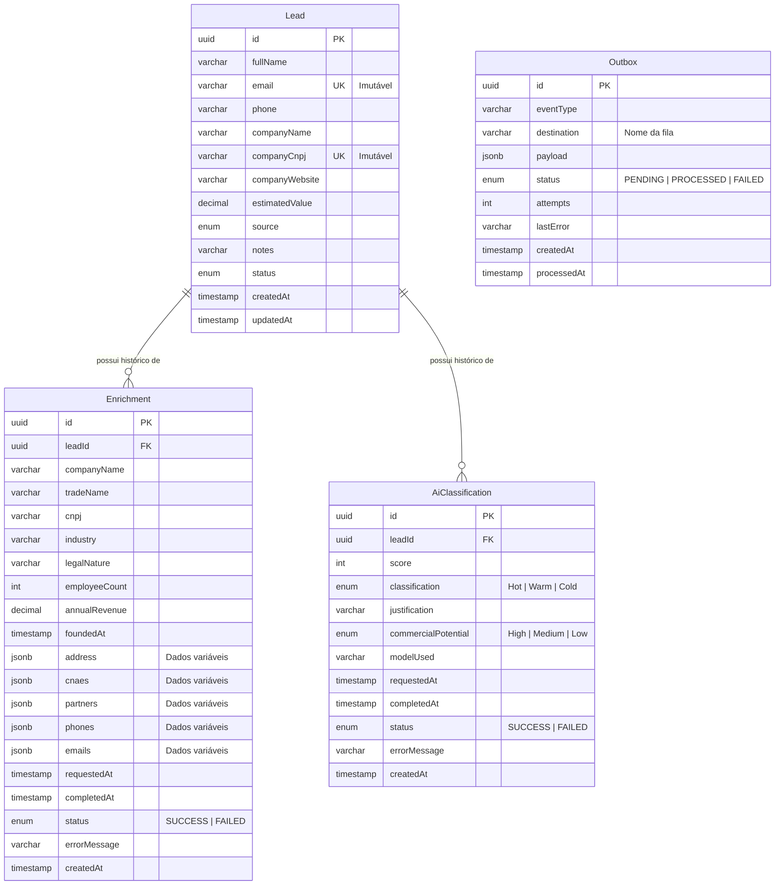

# Sistema de Enriquecimento e Classificação de Leads

*[Read in English / Leia em Inglês](./README.md)*

Este repositório contém um sistema resiliente para gestão de leads comerciais, integrando enriquecimento de dados via API externa e classificação assistida por Inteligência Artificial (Ollama), orquestrado de forma assíncrona.

## Tecnologias

A stack foi escolhida com foco em produtividade, tipagem forte e robustez, seguindo os requisitos do projeto:

- Runtime: Node.js (v20) + TypeScript
- Framework: NestJS (v11) - Escolhido pela arquitetura opinativa e injeção de dependências nativa.
- Persistência: PostgreSQL (v16) + Prisma ORM - Tipagem forte gerada a partir do schema, evitando erros em tempo de execução.
- Mensageria: RabbitMQ - O coração do processamento assíncrono.
- IA Local: Ollama rodando o modelo `tinyllama` - Leve, rápido e não depende de chaves de API externas.
- Qualidade e Testes: Vitest (mais rápido que o Jest padrão) e ESLint/Prettier.
- Infraestrutura: Docker e Docker Compose.

---

## Arquitetura e Decisões de Design

Um aspecto crítico do sistema é garantir a consistência dos dados frente a falhas de APIs externas ou retornos malformados da IA. As decisões abaixo mitigam esses riscos:

### 1. Processamento Assíncrono e Orquestração (Pipeline)

Para não travar as requisições HTTP, a API apenas aceita o lead (HTTP 202 Accepted) e delega o processamento.

Decisão Crítica: Disparar o enriquecimento e a classificação simultaneamente geraria uma condição de corrida, pois a IA precisa dos dados enriquecidos (faturamento, funcionários) para calcular um score preciso.
Solução: Implementei um fluxo encadeado (Pipeline).

1. O Lead é criado e um evento é enfileirado para `enrichment`.
2. O Worker de Enriquecimento processa os dados.
3. Apenas em caso de sucesso, o próprio worker enfileira o evento para `classification`.

**Diagrama 1: Pipeline do Sistema (Visão Geral)**
*(Nota: O mecanismo de publicação confiável de eventos está simplificado aqui. Veja o Diagrama 2 para detalhes).*



**Diagrama 2: Entrega Confiável (Detalhe do Serviço Outbox)**
*(Este diagrama detalha como as setas de "Evento Confiável" no Diagrama 1 realmente funcionam para não perder dados).*



### 2. Resiliência com RabbitMQ (DLX/DLQ)

Sistemas distribuídos falham. Para não perder leads:
- O controle de canal é feito via `amqp-connection-manager`.
- Implementação de Dead Letter Exchanges (DLX) e Dead Letter Queues (DLQ).
- Erros de negócio (ex: IA retornou lixo irrecuperável) geram status `FAILED` e a mensagem recebe `ack`.
- Erros de infraestrutura (ex: banco indisponível, timeout de rede) geram `nack` e a mensagem é roteada para a DLQ, permitindo reprocessamento posterior sem travar a fila principal.

### 3. Máquina de Estados (State Machine)

Um lead possui um ciclo de vida estrito: `PENDING` -> `ENRICHING` -> `ENRICHED` -> `CLASSIFYING` -> `CLASSIFIED`.
Para evitar que uma requisição concorrente tente classificar um lead que ainda está sendo enriquecido, as transições são validadas atomicamente antes de qualquer atualização no banco, garantindo a consistência do domínio.

### 4. Tratamento de "Alucinações" da IA

Modelos pequenos como o `tinyllama` são eficientes, mas podem ignorar instruções do prompt.
- Prompt Engineering: O Ollama é configurado para forçar o output em formato JSON (`format: 'json'`).
- Validação de Schema (Zod): O retorno da IA passa por um parser rigoroso. Se o modelo omitir campos obrigatórios (`score`, `classification`) ou inventar valores fora dos enums permitidos, a execução é marcada como `FAILED`, sem derrubar o worker.

### 5. Histórico Imutável (Event Sourcing "Light")

Para atender ao requisito de rastreabilidade, em vez de sobrescrever os dados do lead, optei por tabelas separadas para `Enrichment` e `AiClassification`. Cada reprocessamento insere um novo registro, permitindo auditar a evolução do score e comparar execuções ao longo do tempo.

### 6. Estratégia de Armazenamento Híbrido (Relacional + Documento)

Um dos maiores desafios do enriquecimento de dados é a heterogeneidade: um lead pode ter 10 sócios e 3 endereços, enquanto outro pode não ter nenhum. Criar colunas fixas para tudo geraria tabelas esparsas (sparse tables) difíceis de manter.
A solução adotada foi um modelo híbrido no PostgreSQL:
- Colunas Fixas (Schema-on-Write): Dados essenciais e previsíveis (como `annualRevenue`, `employeeCount`, `industry`) possuem colunas tipadas. Isso garante integridade e permite consultas analíticas rápidas (ex: `WHERE annualRevenue > 1000000`).
- Campos JSONB (Schema-on-Read): Dados estruturais variáveis (como `partners`, `cnaes`, `address`) são armazenados em colunas `JSONB`. O PostgreSQL lida com JSONB nativamente em formato binário, permitindo indexação interna sem engessar o schema. Se o provedor de dados mudar a estrutura amanhã, o banco não quebra e não exige migrations complexas.

### 7. Outbox Pattern (Mensageria Transacional)

Para evitar o problema de "Dual Write", onde um evento pode ser salvo no banco de dados mas falhar ao ser publicado no RabbitMQ, foi implementado o Outbox Pattern em todo o sistema.
- **Integridade Transacional:** Todo serviço que precisa publicar uma mensagem (API, Enrichment Worker, etc.) salva os dados de negócio e o evento no `Outbox` em uma única transação no banco de dados.
- **Serviço de Outbox Dedicado:** Para manter a API principal como um serviço stateless e altamente escalável, o Outbox Worker é implementado como um serviço separado e independente. Esta separação garante que a natureza stateful do mecanismo de polling (gerenciamento de lógica de retry e batching) não impacte a escalabilidade das operações de gestão de leads.
- **Concorrência e Escalabilidade:** O worker utiliza `FOR UPDATE SKIP LOCKED` do PostgreSQL combinado com índices parciais para garantir que múltiplas instâncias do worker possam rodar em paralelo sem concorrência de locks.
- **Controle de Backpressure:** O worker usa intervalos dinâmicos de polling e "publisher confirms" para evitar sobrecarregar o RabbitMQ durante picos.
- **Arquitetura de Adapters:** A implementação de mensageria é desacoplada através de uma interface `MessagePublisher`, permitindo que o broker subjacente seja trocado no futuro sem alterar a lógica de negócio.

## Modelagem de Dados

O schema foi desenhado para suportar o histórico completo de execuções e mensageria confiável.



---

## Como executar o projeto

A infraestrutura foi totalmente containerizada para facilitar a execução.

### 1. Clonar o repositório
```bash
git clone https://github.com/seu-usuario/lead-management-system.git
cd lead-management-system
```

### 2. Subir a infraestrutura
Este comando fará o build da API e iniciará o PostgreSQL, RabbitMQ, Mock API e Ollama.

```bash
docker compose up -d
```

Atenção: Na primeira execução, o container do Ollama fará o download do modelo `tinyllama` (~637MB). O tempo dependerá da sua conexão. Acompanhe o progresso com:
```bash
docker compose logs -f ollama
```

### 3. Banco de Dados (Migrations e Seed)
O container da API já executa as migrations automaticamente ao subir (`npx prisma migrate deploy`). 

Para popular o banco com leads de teste (CNPJs válidos), execute o comando de seed dentro do container da API:

```bash
docker compose exec api npm run db:seed
```

*Dica de Desenvolvimento:* Se você quiser conectar um cliente de banco de dados (como DBeaver ou DataGrip) na sua máquina local, use `localhost:5432` com usuário `postgres` e senha `password`. Se quiser rodar comandos do Prisma localmente (ex: `npx prisma studio`), mude temporariamente o `DATABASE_URL` no seu arquivo `.env` de `postgres:5432` para `localhost:5432`.

### 4. Acessando a API (O Primeiro Request)
A API estará disponível em `http://localhost:3000`.

Para testar o fluxo completo de ponta a ponta (Criação -> Enriquecimento -> Classificação), execute o seguinte comando no seu terminal:

```bash
curl -X POST http://localhost:3000/leads \
  -H "Content-Type: application/json" \
  -d '{
    "fullName": "João da Silva",
    "email": "joao.silva@techcorp.com",
    "phone": "+5511999991111",
    "companyName": "Tech Corp",
    "companyCnpj": "12345678000199",
    "source": "WEBSITE"
  }'
```

A API retornará um status `201 Created` quase instantaneamente. O trabalho pesado está acontecendo em background.
Para acompanhar os logs da aplicação e ver os workers processando o lead:
```bash
docker compose logs -f api
```

Após alguns segundos, você pode consultar o lead atualizado (substitua o ID pelo retornado no POST):
```bash
curl http://localhost:3000/leads/ID_DO_LEAD
```

### 5. Observabilidade

Para facilitar a visualização do que está acontecendo no sistema, especialmente durante apresentações, duas ferramentas de observabilidade foram incluídas no cluster:

**Dozzle (Visualizador de Logs em Tempo Real):**
- Acesse: `http://localhost:8080`
- O Dozzle permite ver os logs de todos os containers (API, Workers, Ollama, RabbitMQ) diretamente pelo navegador, com busca e filtros, sem precisar usar o terminal.

**RabbitMQ Management UI (Monitoramento de Filas):**
- Acesse: `http://localhost:15672`
- Usuário: `guest`
- Senha: `guest`
- Através deste painel, você pode ver as mensagens trafegando entre as filas (`lead.enrichment`, `lead.classification`), verificar a taxa de processamento e inspecionar a Dead Letter Queue (DLQ) em caso de falhas. *(Nota: As credenciais padrão `guest/guest` são usadas apenas para o ambiente de desenvolvimento local).*

---

## Rodando os Testes

O projeto utiliza o Vitest para testes unitários e de integração.

```bash
# Executar testes
docker compose exec api npm run test

# Executar testes com relatório de cobertura
docker compose exec api npm run test:cov
```

---

## Endpoints Principais

### Leads
- `POST /leads` - Cria um novo lead (dispara o enriquecimento automaticamente).
- `GET /leads` - Lista os leads. Suporta paginação (`?page=1&limit=10`) e filtros (`?search=termo&source=WEBSITE`).
- `GET /leads/:id` - Traz os detalhes do lead, incluindo o histórico de enriquecimento e classificação.
- `PATCH /leads/:id` - Atualiza dados (exceto `email` e `companyCnpj`, que são imutáveis).
- `GET /leads/export` - Rota dedicada para exportação dos dados consolidados.

### Fluxos Assíncronos (Reprocessamento)
- `POST /leads/:id/enrichment` - Solicita um novo enriquecimento.
- `POST /leads/:id/classification` - Solicita uma nova classificação pela IA.

---

## Trade-offs e Limitações

Toda arquitetura envolve escolhas. Abaixo estão os principais trade-offs assumidos nesta implementação:

1. **Armazenamento Híbrido (JSONB) vs Colunas Fixas:**
   - *Decisão:* Usar `JSONB` para dados variáveis de enriquecimento (como sócios e CNAEs).
   - *Trade-off:* Ganhamos extrema flexibilidade para lidar com APIs externas que mudam de contrato, mas perdemos a capacidade de criar Foreign Keys (chaves estrangeiras) rígidas para esses dados específicos.

2. **Ollama Local (tinyllama) vs API Proprietária (OpenAI/Anthropic):**
   - *Decisão:* Usar um modelo local pequeno para fornecer uma solução com bom custo-benefício, sem depender de APIs externas pagas.
   - *Trade-off:* O `tinyllama` é rápido, mas tem maior propensão a "alucinações" e quebra de formatação JSON comparado a modelos maiores. A mitigação foi o uso de validação estrita (Zod), mas em um ambiente de produção com orçamento, uma API externa gerenciada entregaria classificações mais precisas.

3. **Polling vs Webhooks/SSE:**
   - *Decisão:* O cliente precisa fazer um `GET /leads/:id` para verificar se o processamento assíncrono terminou.
   - *Trade-off:* Mantém a arquitetura backend simples e focada nos workers. Em um cenário real de frontend reativo, a implementação de Webhooks ou Server-Sent Events (SSE) seria necessária para notificar o cliente em tempo real, mas adicionaria complexidade fora do escopo atual.

---

## Melhorias Futuras (Visão de Produção)

Para um ambiente produtivo de alta escala, as seguintes melhorias seriam implementadas:
1. Cache (Redis): Evitar chamadas repetidas à API de enriquecimento para o mesmo CNPJ em curtos períodos.
2. Autenticação e Autorização: Proteger os endpoints com JWT e RBAC (Role-Based Access Control).
3. Observabilidade (Prometheus/Grafana): Monitorar o tempo médio de resposta do Ollama e a taxa de falhas de parsing do JSON. Modelos estocásticos exigem monitoramento contínuo.
4. Rate Limiting: Proteger a API contra abusos, especialmente nas rotas que disparam processamento em background.