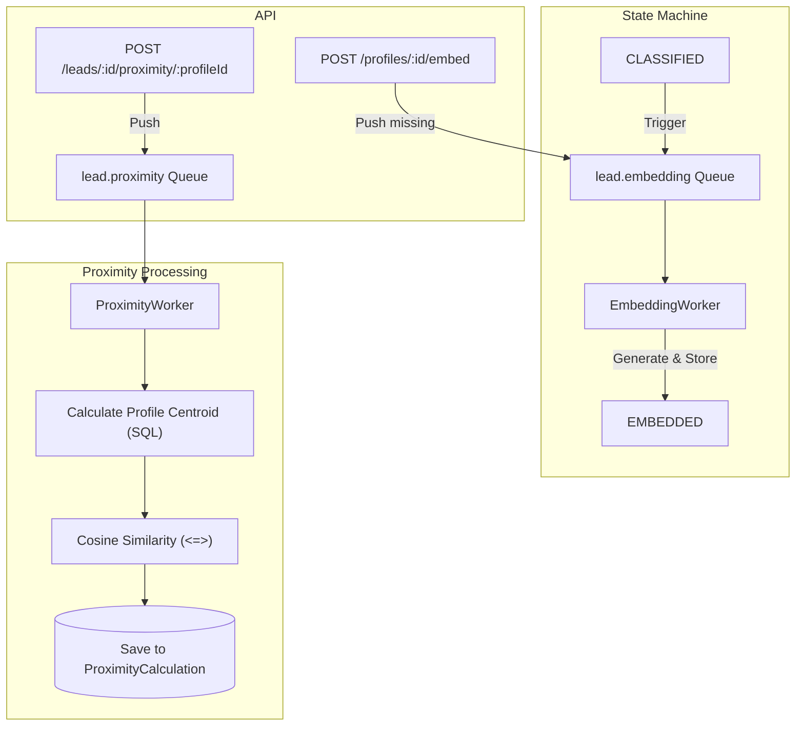

# Proximity Search Implementation Plan

This plan outlines the steps to implement an asynchronous vector-based proximity search using `pgvector` and Ollama, introducing profiles and scalable queue processing.

## 1. Database Schema & Migration
- **Lead State Machine Update**: Add `EMBEDDING` and `EMBEDDED` states to `LeadStatus` enum in `prisma/schema.prisma`. The flow becomes: `CLASSIFIED` -> `EMBEDDING` -> `EMBEDDED`.
- **Pgvector Support**:
  - Add an `embedding` column to the `Lead` model: `embedding Unsupported("vector(768)")?`.
  - Ensure the database migration creates the `vector` extension.
- **New Entities**:
  - `LeadProfile`: Represents a cluster of history leads (e.g., "Leads sold for reason XYZ"). Includes a many-to-many relationship with `Lead` (the leads attached to this profile).
  - `ProximityCalculation`: Represents the proximity calculation result of a specific `Lead` against a specific `LeadProfile`. Has a Many-to-One relationship with `Lead` (a lead can have multiple calculations) and `LeadProfile`.

## 2. Queue Configuration (RabbitMQ)
- Update `src/rabbitmq/rabbitmq.service.ts` to define two new queues:
  - `lead.embedding`: For asynchronous generation of vector embeddings.
  - `lead.proximity`: For asynchronous calculation of vector proximity between a lead and a profile.

## 3. Ollama Service Enhancement
- Update `src/ollama/ollama.service.ts` to support generating embeddings.
- Add a method to call the Ollama `/api/embeddings` endpoint using the `nomic-embed-text` model.

## 4. Workers Implementation
- **EmbeddingWorker** (`src/embedding/embedding.worker.ts`):
  - Listens to the `lead.embedding` queue.
  - Updates lead status to `EMBEDDING`.
  - Calls `OllamaService` to generate the embedding for the lead data.
  - Saves the vector using raw SQL and updates status to `EMBEDDED`.
  - If a lead transitions from `CLASSIFIED` in the normal flow, it will automatically be pushed here.
- **ProximityWorker** (`src/proximity/proximity.worker.ts`):
  - Listens to the `lead.proximity` queue.
  - Calculates the centroid (average vector) of all leads currently attached to the target `LeadProfile`.
  - Calculates the cosine distance (`<=>`) between the target lead's embedding and the profile centroid.
  - Saves the result into the `ProximityCalculation` table.

## 5. API Endpoints
- **Profile Management**: CRUD for `LeadProfile` and endpoints to attach/detach leads.
- **Trigger Embedding**: An endpoint to trigger embedding generation for an entire cluster/profile (pushes non-embedded leads in the profile to the `lead.embedding` queue).
- **Trigger Proximity Calculation**: An endpoint to trigger the proximity calculation for a given lead against a specific profile (pushes to `lead.proximity` queue).

## Mermaid Architecture Flow
